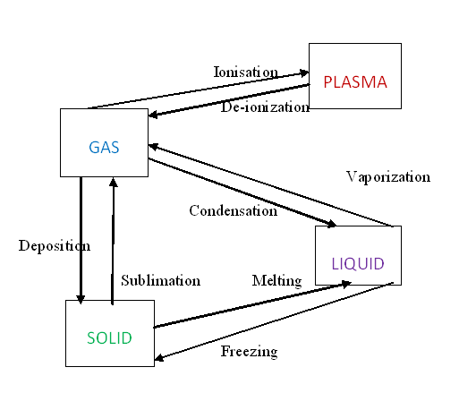
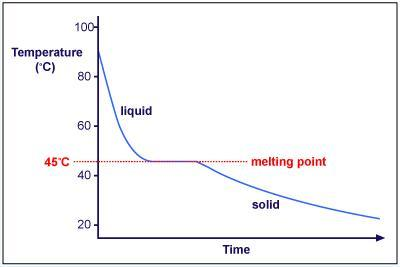

### Theory 

The term change of phase means the same thing as the term change of state. The change of phase always occurs with a change of heat. However the temperature does not change. When we heat a solid, the energy supplied is used to increase the kinetic energy of its molecules, and thereby its temperature increases. Energy is required to melt a solid, because the cohesive forces between molecules must be partially overcome to allow the molecules to move about. Similarly, energy is required to vaporize a liquid, because in so doing the molecules are separated and molecular attractive forces are overcome. But there is no temperature change until a phase change is complete.  i.e. during phase change, the energy supplied is used only to separate the molecules ; no part of it is used to increase the kinetic energy of the molecules. So its temperature will not rise, since kinetic energy of molecules remains the same.

The quantity of heat absorbed or released when a substance changes its physical phase at constant temperature (e g. From solid to liquid at melting point or from liquid to gas at boiling point) is termed as its latent heat. The quantity of heat absorbed or released when unit mass of a substance changes its physical phase at a given temperature is called specific latent heat. The constant temperature at which melting or boiling take place is known as the melting or boiling point.

 The process, phase transition is governed by Newton's law of cooling, which states that,

"The rate of change of temperature of an object is proportional to the difference between its own temperature and the temperature of its surroundings."

$$ \frac{dT}{dt}=-k(T-T_{a})$$

where , $T$ is the temperature of the object, $k$ is a positive constant, $T_{a}$ is the temperature of the surroundings.

By studying the phase change of a substance from solid to liquid, one can determine the melting point, latent heat of fusion etc of  the substance.
In order to understand more about the theory of phase change, consider a sample cooling curve for a substance with a melting point of $45^{0}C$ .

The flat portion of the graph represents the phase change from liquid to solid at the constant melting temperature $45^{0}C$. The two curved portions represent cooling of the liquid plus the tube (left) and cooling of the solid plus the tube (right). These cool according to Newton’s law of cooling,

$$\frac{dT}{dt}=-k(T-T_{0})$$

where $T$ is the temperature of the sample, $T_{0}$ is room temperature, and $k$ is a positive constant. 

  

 

The heat loss rate of the liquid plus the boiling tube is likely to be the same as the heat loss rate of the solid plus the tube for a given temperature difference $(T-T_{0})$

The specific heat $C_{2}$ of the material undergoing phase change is, however, unlikely to be the same for the liquid and the solid phases. Thus we have

$$\frac{dQ}{dt}=(m_{1}c_{1}+m_{2}c_{2l})\frac{dT}{dt}=-(m_{1}c_{1}+m_{2}c_{2l})k_{l}(T-T_{0})$$

and

$$\frac{dQ}{dt}=(m_{1}c_{1}+m_{2}c_{2s})\frac{dT}{dt}=-(m_{1}c_{1}+m_{2}c_{2s})k_{s}(T-T_{0})$$

where upon it can be seen that the cooling constants in the liquid (l) and solid (s) phases are related by the equation

$$(m_{1}c_{1}+m_{2}c_{2l})k_{l}=(m_{1}c_{1}+m_{2}c_{2s})k_{s}$$

These cooling constants can be estimated by using the graph to estimate the time te taken for the material plus the tube to cool to 1/e of their starting temperature above room temperature. Then since the solution to the Newton’s law of cooling differential equation is

$$T=T_{0}+(T-T_{0})e^{-kt}$$

we have $k=1/t_{e}$

