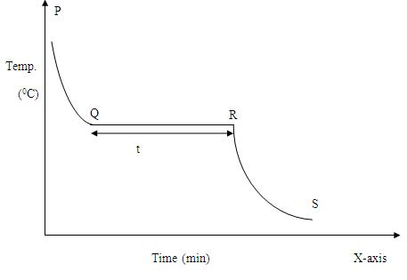

## Procedure

### Cooling Curve

  

 

The cooling curve has three distinct regions.
- The cooling region PQ for the liquid
- QR for the phase change
- RS for the solid
The temperature corresponding to the horizontal region QR of the cooling curve gives the transition temperature. The time for phase change is noted from the graph. It is given by the interval for the horizontal region QR of the graph. The rate of cooling $r=dT/dt$ in the region RS is also calculated.

### Procedure for doing the Simulator

- From the combo box **Select Substance** select the desired sample.
- The mass of the substance can be varied by using the slider **Mass of the substance**.
- The temperature of the surrounding can be selected by using the slider **Surrounding Temperature**.
- The mass, radius and thickness of the boiling tube can be varied by using the sliders given under the heading **Boiling tube**.
- The experiment can be started by clicking on the **Start  the Experiment** button.
- Then the sample in the boiling tube begins to melt.
- The temperature of the sample can be noted from the digital thermometer given in the simulator.
- Also time can be noted from the stop-watch given in the simulator.
- The time-temperature observation is also plotted there.
- There is an option **Show Result**. By clicking it, we can obtain the melting point and the transition time of the sample.

### Procedure for doing Real Lab

- The mass $m_{1}$ of the empty boiling tube is taken.
- Sample of mass $m_{2}$ is put into the boiling tube. It is melted by keeping the test tube immersed in hot oil bath. The sample melts into clear liquid.
- When it is melted completely, the test tube is taken out, wiped dry, suspend in air and allowed to cool.
- A thermometer is immersed into the melt. A stop-watch is started and the temperature is noted for every equal interval of time. The time-temperature observation is taken till the liquid get frozen into solid and gets cooled to room temperature. 
- Draw a cooling curve by taking time along the X- axis and temperature along Y-axis. The temperature corresponding to the horizontal region will give the transition temperature.
- The time for the transition time is also noted from the graph. The experiment is repeated for different samples.

### Observations and Calculations

Mass of the sample, $m_{2}$                                  =  ................... $kg$

Specific heat capacity of glass, $C_{1}$                   =  ................... $Jkg^{-1}K^{-1}$

Specific heat capacity of sample, $C_{2}$                =  ................... $Jkg^{-1}K^{-1}$

<table>
  <thead>
    <tr>
      <th>Time in minutes</th>
      <th>Temperature in °C</th>
    </tr>
  </thead>
  <tbody>
    <tr>
      <td>  
1 
   </td>
      <td>    </td>
    </tr>
    <tr>
      <td>  
2 
   </td>
      <td>    </td>
    </tr>
    <tr>
      <td>  
3 
   </td>
      <td>    </td>
    </tr>
    <tr>
      <td>  
... 
   </td>
      <td>    </td>
    </tr>
  </tbody>
</table>

## Result
The cooling curve for the phase change of the sample is studied.

Transition time of the sample     = .................. min

Melting point of the sample        = ........................ $^{0}C$

